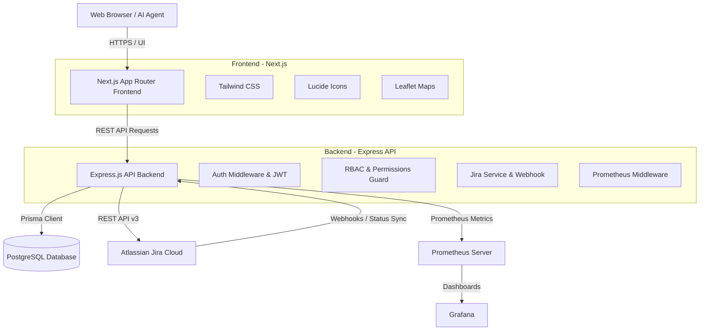
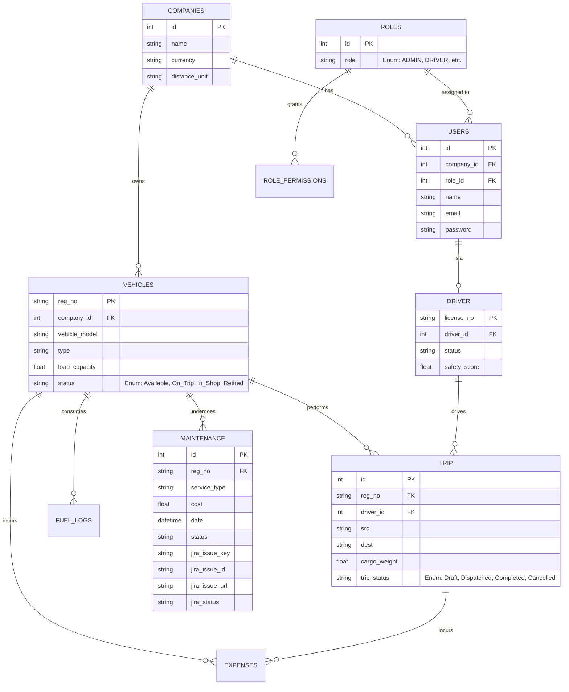

# TransitOps - Fleet & Logistics Management System

TransitOps is a comprehensive, full-stack logistics and fleet management platform designed to streamline vehicle operations, driver allocations, trip dispatching, fuel consumption, maintenance work orders, and financial tracking—all backed by multi-tenant isolation, role-based access control (RBAC), and bi-directional Atlassian Jira integration.

---
## 🌟 Key Features

- **Fleet & Vehicle Inventory**: Track vehicle status (`Available`, `On_Trip`, `In_Shop`, `Retired`), capacity, odometer readings, and acquisition cost.
- **Driver Management**: Monitor driver roster, safety scores, licensing details with expiry alerts, and trip completion rates.
- **Trip Dispatching & Live Tracking**: Interactive Leaflet maps for route selection (`src_lat`, `src_lng`, `dest_lat`, `dest_lng`), payload capacity enforcement, and a real-time dispatch Kanban board.
- **Fuel & Expense Tracking**: Log fuel consumption per vehicle and allocate trip-linked operational expenses (tolls, maintenance, misc).
- **Maintenance & Work Orders**: Schedule services (Routine Service, Oil Change, Tire Replacement, Brake Service, Engine Repair), automatically transition vehicle status to `In_Shop`, and sync work orders directly with Atlassian Jira.
- **Atlassian Jira Integration**: Bi-directional integration creating Jira issues on maintenance logs, with an inbound webhook listener (`POST /api/v1/integrations/jira/webhook`) that marks work orders complete and returns vehicles to `Available` upon ticket resolution.
- **Atlassian Remote MCP v2 Support**: Integrated Model Context Protocol (`https://mcp.atlassian.com/v2/mcp`) for AI coding agents with OAuth 2.1 authentication.
- **Role-Based Access Control (RBAC)**: Enforce granular access across resources (`FLEET`, `DRIVERS`, `TRIPS`, `FUEL_EXPENSE`, `ANALYTICS`) for roles: `ADMIN`, `FLEET_MANAGER`, `DISPATCHER`, `DRIVER`, `SAFETY_OFFICER`, and `FINANCIAL_ANALYST`.
- **Multi-Tenancy & Settings**: Organization isolation by company ID with configurable currency (`INR`, `USD`, `EUR`, etc.) and distance measurement units.
- **Observability & Metrics**: Native Prometheus metrics (`/metrics`) and custom Grafana dashboard tracking latency, throughput, error rates, and system resources.

---

## 🏗 System Architecture

TransitOps is built with a Next.js frontend and an Express.js backend powered by Prisma ORM and PostgreSQL.



---

## 🗄 Database Schema (ERD)

The relational database is structured for high operational consistency and transactional integrity.



---

## 🛠 Tech Stack

### Frontend
- **Framework**: [Next.js](https://nextjs.org/) (App Router, React 19)
- **Styling**: [Tailwind CSS](https://tailwindcss.com/)
- **Icons & UI**: [Lucide React](https://lucide.dev/)
- **Maps**: [Leaflet](https://leafletjs.com/) & [React-Leaflet](https://react-leaflet.js.org/)

### Backend
- **Runtime & Language**: Node.js (v22), TypeScript
- **Framework**: [Express.js](https://expressjs.com/)
- **Database & ORM**: PostgreSQL, [Prisma ORM](https://www.prisma.io/)
- **Authentication**: JWT, bcryptjs, Nodemailer (Mailtrap SMTP)
- **Integrations**: Atlassian Jira Cloud REST API, Model Context Protocol (MCP)
- **Metrics**: `prom-client` (Prometheus)

---

## 🚀 Getting Started

### Prerequisites
- Node.js (v20+)
- pnpm (v9+)
- PostgreSQL Database
- Docker & Docker Compose (optional)

### 1. Backend Setup

```bash
cd backend

# Install dependencies
pnpm install

# Configure environment variables
cp .env.example .env
# Edit .env with your PostgreSQL credentials, JWT secret, and optional Jira settings

# Run database migrations
pnpm exec prisma migrate dev

# Seed database with sample fleet, roles, and users
pnpm exec prisma db seed

# Start development server
pnpm dev
```
The API server runs by default at `http://localhost:3000`. Swagger documentation is available at `http://localhost:3000/api-docs`.

### 2. Frontend Setup

```bash
cd frontend

# Install dependencies
pnpm install

# Start development server
pnpm dev
```
The frontend web application runs at `http://localhost:3000` (or `http://localhost:3001` if running alongside the backend on port 3000).

---

## 🔗 Jira & Atlassian MCP Integration

### Jira Work Order Synchronization
* When a maintenance service is logged in TransitOps, a Jira task is created in your Atlassian project.
* The maintenance record stores `jira_issue_key`, `jira_issue_id`, `jira_issue_url`, and `jira_status`.
* The frontend displays direct links and live Jira status badges.
* **Webhook Endpoint**: `POST /api/v1/integrations/jira/webhook`
  * When a ticket is marked as `Done` / `Resolved` in Jira, the webhook listener marks the maintenance order as `Completed` and automatically resets the vehicle's status to `Available`.

### Atlassian Remote MCP v2 Setup
TransitOps supports the official Atlassian MCP Server for AI assistants:
* **Server URL**: `https://mcp.atlassian.com/v2/mcp`
* **Transport**: Streamable HTTP
* **Auth**: OAuth 2.1 (or Personal API Token)
* Configured in [`.agents/mcp_config.json`](./.agents/mcp_config.json).

---

## 🐳 DevOps, Docker & Monitoring

### Local Development (Docker Compose)
Run the entire stack locally with Docker Compose:
```bash
docker compose up --build
```
* **Frontend**: `http://localhost:3001`
* **Backend API**: `http://localhost:3000` (`/health`, `/metrics`, `/docs`)
* **Grafana Dashboard**: `http://localhost:3002` (Credentials: `admin` / `admin`)
* **Prometheus**: `http://localhost:9090`

### Production Deployment (AWS EC2 + Caddy Reverse Proxy)
For production deployments, the stack is orchestrated via [`docker-compose.prod.yml`](./docker-compose.prod.yml) fronted by Caddy:

```bash
# Automated 1-click EC2 provisioner (Free-Tier eligible)
./aws/provision-ec2.sh
```

#### Production Features:
* **Caddy Reverse Proxy**: Serves all traffic on standard HTTP/HTTPS (`80` / `443`), routes `/api/*` to the Express backend and `/*` to Next.js frontend, avoiding CORS issues.
* **Persistent PostgreSQL**: Database mounted to persistent volume with automated migrations on boot.
* **Continuous Deployment**: Automated GitHub Actions workflow in [`.github/workflows/deploy.yml`](./.github/workflows/deploy.yml) deploys updates to the EC2 server upon push to `main`.

---

## 🤖 Continuous Integration & Deployment (GitHub Actions)

The repository includes automated CI/CD workflows:
1. **[`.github/workflows/ci.yml`](./.github/workflows/ci.yml)**:
   * **Backend CI**: Dependencies, Prisma Client generation, TypeScript typechecking (`tsc --noEmit`).
   * **Frontend CI**: Next.js production build (`pnpm build`).
   * **Docker Build CI**: Multi-stage container builds for both backend and frontend.
   * **Manifest Validation**: Syntactic verification of Docker Compose & Prometheus configurations.
2. **[`.github/workflows/deploy.yml`](./.github/workflows/deploy.yml)**:
   * **Continuous Deployment**: Automatically deploys commits on `main` directly to the live AWS EC2 server over SSH.


---

## 🤝 Contributing
1. Fork the repository
2. Create your feature branch (`git checkout -b feature/amazing-feature`)
3. Commit your changes (`git commit -m 'Add some amazing feature'`)
4. Push to the branch (`git push origin feature/amazing-feature`)
5. Open a Pull Request
