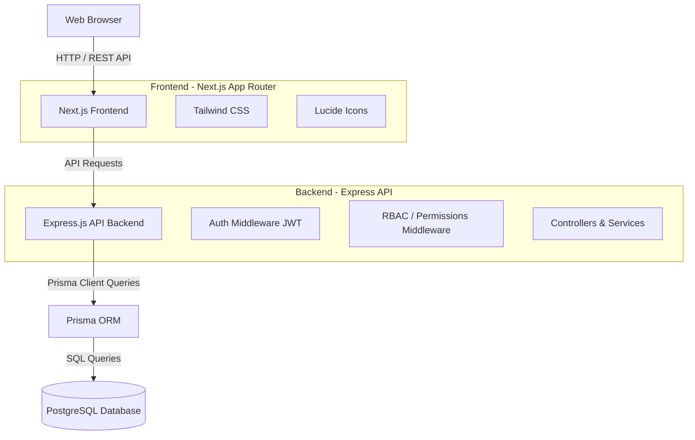
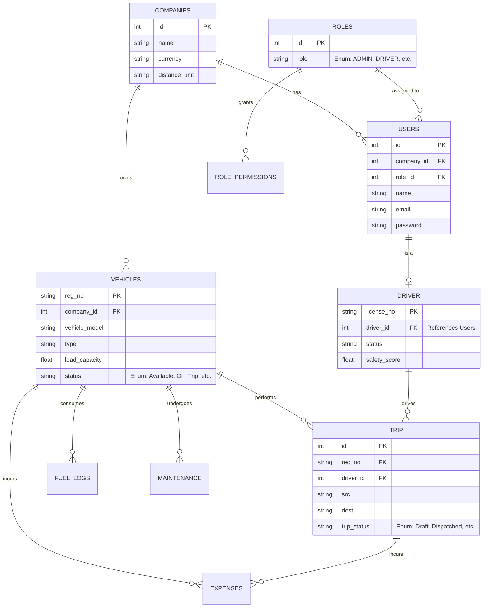

# TransitOps - Fleet Management System

TransitOps is a comprehensive, full-stack logistics and fleet management platform designed to streamline the operations of transport and logistics companies. It provides tools for managing vehicles, drivers, trips, fuel consumption, maintenance, and expenses, all within a role-based access control system.

## 🌟 Key Features

- **Fleet Management**: Track vehicle status, details, capacity, and cost.
- **Driver Management**: Monitor driver statuses, safety scores, licenses, and contact information.
- **Trip Tracking**: Create, dispatch, and track trips from source to destination with real-time status updates.
- **Fuel & Expense Tracking**: Log fuel consumption and trip-related expenses (maintenance, toll, others) to calculate operating costs.
- **Maintenance Records**: Schedule and track vehicle maintenance (routine, oil changes, brake service, etc.).
- **Role-Based Access Control (RBAC)**: Secure access with distinct roles (`ADMIN`, `DRIVER`, `FLEET_MANAGER`, `DISPATCHER`, `SAFETY_OFFICER`, `FINANCIAL_ANALYST`) and granular permissions.
- **Company Multi-tenancy**: Designed to support organizational structures and company-specific configurations.

---

## 🏗 System Architecture

The application is built on a modern stack featuring a Next.js frontend and an Express.js backend powered by Prisma and PostgreSQL.



---

## 🗄 Database Schema (ERD)

The relational database is carefully structured to handle complex fleet operations. 
[View the detailed Database Design Document](https://drive.google.com/file/d/1b_byAQeu0nbLQVDn76YKu6tdoJpmf7vp/view?usp=sharing)



---

## 🛠 Tech Stack

### Frontend
- **Framework**: [Next.js](https://nextjs.org/) (App Router)
- **Library**: [React 19](https://react.dev/)
- **Styling**: [Tailwind CSS v4](https://tailwindcss.com/)
- **Icons**: [Lucide React](https://lucide.dev/)

### Backend
- **Framework**: [Express.js](https://expressjs.com/)
- **Language**: TypeScript
- **ORM**: [Prisma](https://www.prisma.io/)
- **Database**: PostgreSQL
- **Security**: JWT Authentication, Custom Role & Permission Middleware

---

## 🚀 Getting Started

### Prerequisites
- Node.js (v20+)
- pnpm (recommended) or npm/yarn
- PostgreSQL Database
- Docker (optional, for running the database)

### Backend Setup
1. Navigate to the backend directory:
   ```bash
   cd backend
   ```
2. Install dependencies:
   ```bash
   pnpm install
   ```
3. Set up your `.env` file (copy from `.env.example` if available) and ensure `DATABASE_URL` is set.
4. Run Prisma migrations:
   ```bash
   pnpm dlx prisma migrate dev
   ```
5. Start the development server:
   ```bash
   pnpm dev
   ```

### Frontend Setup
1. Navigate to the frontend directory:
   ```bash
   cd frontend
   ```
2. Install dependencies:
   ```bash
   pnpm install
   ```
3. Start the Next.js development server:
   ```bash
   pnpm dev
   ```

The frontend will be available at `http://localhost:3000` and the API backend typically at `http://localhost:5000` (depending on your `.env` configuration).

---

## 🚀 DevOps, Kubernetes & Monitoring Setup

This repository includes a 100% reproducible local Kubernetes deployment powered by **Prometheus**, **Grafana**, and **GitHub Actions CI**.

### Step-by-Step Deployment Instructions

#### 1. Build Docker Images
```bash
# Build backend container image
docker build -t odoo-backend:latest ./backend

# Build frontend container image
docker build -t odoo-frontend:latest ./frontend

# (If using Minikube, load images into the cluster):
# minikube image load odoo-backend:latest
# minikube image load odoo-frontend:latest
```

#### 2. Apply Kubernetes Manifests (`/k8s`)
```bash
# Create the 'odoo-app' isolated namespace
kubectl apply -f k8s/namespace.yaml

# Deploy PostgreSQL database (PVC, Deployment, Service)
kubectl apply -f k8s/postgres.yaml

# Deploy Express Backend API & Next.js Frontend
kubectl apply -f k8s/backend.yaml
kubectl apply -f k8s/frontend.yaml
```

#### 3. Deploy Prometheus & Grafana Stack via Helm
```bash
# Add Prometheus Helm repository
helm repo add prometheus-community https://prometheus-community.github.io/helm-charts
helm repo update

# Install kube-prometheus-stack in 'monitoring' namespace
helm install prometheus-stack prometheus-community/kube-prometheus-stack \
  --namespace monitoring \
  --create-namespace \
  --set grafana.adminPassword="admin" \
  --set prometheus.prometheusSpec.serviceMonitorSelectorNilUsesHelmValues=false

# Apply ServiceMonitor target for backend metrics
kubectl apply -f k8s/servicemonitor.yaml
```

#### 4. Access Services & Grafana Dashboard
* **Backend API:** `http://localhost:30000` (Health: `/health`, Metrics: `/metrics`)
* **Frontend Web App:** `http://localhost:30001`
* **Grafana Dashboard:** `http://localhost:3002` (User: `admin` | Password: `admin`)
  ```bash
  # Port forward Grafana service to access dashboard locally
  kubectl port-forward svc/prometheus-stack-grafana 3002:80 -n monitoring
  ```

### Kubernetes Architecture & Manifest Files (`/k8s`)
* [`k8s/namespace.yaml`](file:///c:/Users/yomes/odoo-hackathon/k8s/namespace.yaml): Creates `odoo-app` isolated namespace.
* [`k8s/postgres.yaml`](file:///c:/Users/yomes/odoo-hackathon/k8s/postgres.yaml): PostgreSQL Storage (PVC), Deployment, and Service.
* [`k8s/backend.yaml`](file:///c:/Users/yomes/odoo-hackathon/k8s/backend.yaml): Express API deployment with Prometheus scrape annotations + NodePort Service (:30000).
* [`k8s/frontend.yaml`](file:///c:/Users/yomes/odoo-hackathon/k8s/frontend.yaml): Next.js web app deployment + NodePort Service (:30001).
* [`k8s/servicemonitor.yaml`](file:///c:/Users/yomes/odoo-hackathon/k8s/servicemonitor.yaml): Prometheus Operator target configuration.
* [`k8s/grafana-dashboard.json`](file:///c:/Users/yomes/odoo-hackathon/k8s/grafana-dashboard.json): Pre-configured Grafana dashboard JSON (HTTP RPS, Error Rate, Latency, Memory).

---

## 🤝 Contributing
1. Fork the repository
2. Create your feature branch (`git checkout -b feature/amazing-feature`)
3. Commit your changes (`git commit -m 'Add some amazing feature'`)
4. Push to the branch (`git push origin feature/amazing-feature`)
5. Open a Pull Request

# studious-carnival

